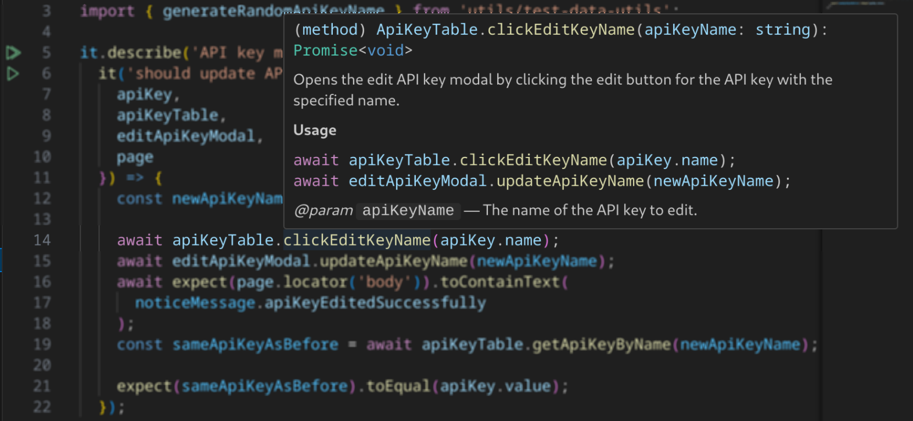

# Introduction

This repository contains tests for https://openweathermap.org/

# Table Of Contents

- [Introduction](#introduction)
- [Table Of Contents](#table-of-contents)
- [Prerequisites](#prerequisites)
- [System Requirements](#system-requirements)
- [Setup](#setup)
- [Running Tests](#running-tests)
- [Viewing The Last Test Report](#viewing-the-last-test-report)
- [Taken Approach](#taken-approach)
  - [Test Setup](#test-setup)
  - [UI](#ui)
    - [Interacting With Page Elements](#interacting-with-page-elements)
    - [Chosen Approach To Writing UI Tests](#chosen-approach-to-writing-ui-tests)
  - [API](#api)
    - [Chosen Approach To Writing API Tests](#chosen-approach-to-writing-api-tests)

# Prerequisites

Adjust values based on the test environment:

1. An active account. ([Register in Prod](https://home.openweathermap.org/users/sign_up))
2. An activated API key. ([My API Keys in Prod](https://home.openweathermap.org/api_keys))
3. A home page URL. Prod: "https://home.openweathermap.org/"
4. A base API URL. Prod: "https://api.openweathermap.org/"

Copy the `.env.example` file, rename it to `.env` and fill in the values.

Example:

```Shell
# .env
API_KEY=123456
BASE_URL=https://home.openweathermap.org/
BASE_API_URL=https://api.openweathermap.org/
USER_EMAIL=test@gmail.com
USER_PASSWORD=Test@2024_UI_API
```

# System Requirements

- Node.js 18+
- Operating system:
  - Windows 10+, Windows Server 2016+ or Windows Subsystem for Linux (WSL).
  - macOS 13 Ventura, or macOS 14 Sonoma.
  - Debian 11, Debian 12, Ubuntu 20.04 or Ubuntu 22.04, Ubuntu 24.04, on x86-64 and arm64 architecture.

# Setup

```Shell
# Install dependencies.
npm i

# Install Playwright browsers.
npx playwright install

# Install Playwright operating system dependencies.
sudo npx playwright install-deps
```

# Running Tests

```Shell
# Run the end-to-end tests.
npm test

# Start the interactive UI mode.
npm run ui

# Run the tests in debug mode.
npm run debug
```

# Viewing The Last Test Report

```Shell
# To open the most recent HTML report in your default browser.
npm run report
```

# Taken Approach

It's based on my [style guide](https://github.com/LinkPovilas/end-to-end-test-guides/blob/main/docs/playwright-style-guide.md) which I created to maintain consistency, document lessons learned, and share it with others.

Tests were written with parallelization in CI in mind (see [test sharding](https://playwright.dev/docs/test-sharding)) to ensure that they do not interfere with each other. I considered creating a "cleanup test job" to run before other tests and delete all API keys except the default one when running in CI. However, this is beyond the scope of the task requirements.

Hopefully, each section of the document will help you better understand the decisions made in completing the task.

## Test Setup

The tests share authentication setup which consists of the user interface steps required to authenticate the user and save the browser state locally, avoiding the need to re-authenticate for each test.

## UI

### Interacting With Page Elements

I've decided to use [Lean Page Objects](https://github.com/LinkPovilas/end-to-end-test-guides/blob/main/docs/playwright-style-guide.md#page-objects) (or "Page Component Objects") to drive the UI tests.

- Their state and dependencies are handled by Playwright (see fixture files).
- Chosen locator strategies are based on the recommendations by [Playwright](https://playwright.dev/docs/locators#locate-by-role) and [Testing library](https://testing-library.com/docs/queries/about#priority) teams. Some of the web elements lacked meaningful ways how to locate them (such as dropdown menu).
- For class methods and utility functions I've added JSDoc comments so the user could see additional information, such as usage, in the tooltip by hovering over the code line. For example: 

### Chosen Approach To Writing UI Tests

Since we start in an already authenticated state for each test, I've decided to move the steps needed to navigate to the "My API Keys" page into a separate test suite, and instead navigate directly to the page URL.

I created an `apiKey` fixture, which is used in both UI and API tests to avoid setup duplication.

Splitting by concern like this, in my opinion, allows us to have shorter, more focused tests without sacrificing test coverage.

## API

I chose to use the `URL()` constructor to have a flexible way to modify the API request URLs.

To validate mandatory and optional fields, and data types I chose to use Zod JSON schema validation library. Which also allowed me to handle cases where the error codes are returned in either `number` or `string` type.

I created custom matchers:

- `toHaveStatus(number)` to validate HTTP status code and throw an error with response body and header details, because I wanted to have quick feedback to understand what was the error and also, hypothetically, to be able to investigate application logs more quickly when required, for example, by something like `traceId` response header.
- `toMatchSchema(zodSchema)` to validate by schema, so I would not have to repeat myself and keep the code as DRY as possible.

Custom matcher `toMatchSchema(zodSchema)` requires for the provided data to have some type other than `any`. I chose to use Zod library to infer the types from the schemas, instead of using `unknown` type or creating `interfaces` manually.

### Chosen Approach To Writing API Tests

I wrote several tests to cover main functionality scenarios and error handling.

Interesting cases:

- There is a test to validate that a newly created API key is not a valid key yet, because it might take a couple hours to activate it. See https://openweathermap.org/faq#error401. Test reuses `apiKey` fixture.
- For testing different unit of measurements I compared the values making sure that Fahrenheit values were not equal to Kelvin, and Kelvin was higher than Celsius, and that Fahrenheit was higher than Celsius, except for one specific case. As a safeguard I also added schema validations to ensure numeric values for temperatures.
- For testing if city names and description are translated, I provided an example of a [data driven test](https://playwright.dev/docs/test-parameterize#parameterized-tests).To ensure that the properties were translated, I checked if the city name was equal to the expected one and compared the descriptions expecting them not to match - if they matched it would mean that both are in English. Just in case, I added schema validation to avoid cases where description contained `null` value or similar.
